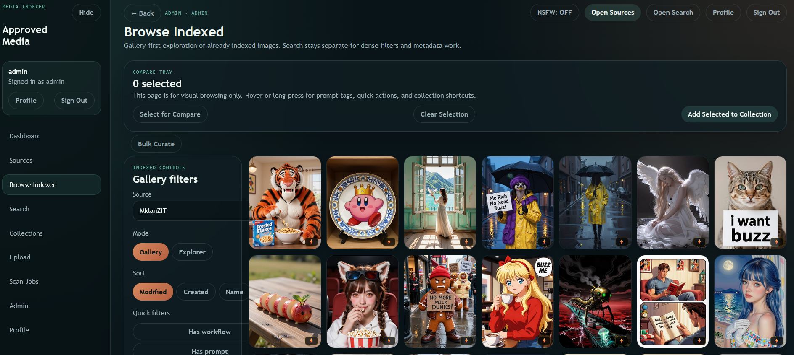
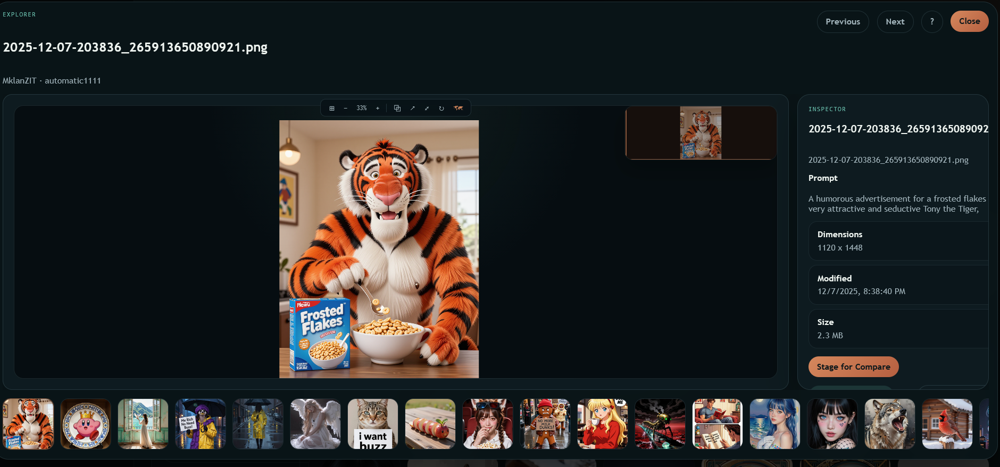
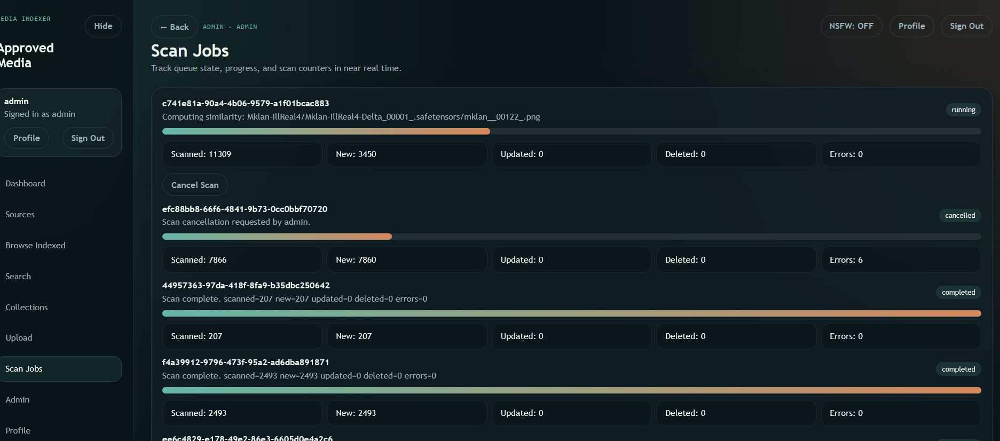

# MKLanLocal

> A self-hosted, modular media indexer for local photo and video libraries.
> Search, curate, enrich, and process media on your own hardware with built-in modules plus installable addons.

**Stack:** FastAPI · Next.js · PostgreSQL + pgvector · Docker Compose

---

## Screenshots

### Browse Indexed - Gallery view
Browse and curate your indexed library with filters, sort options, bulk select, and quick actions.



### Asset Explorer - Detail and inspector panel
Open any image in the full-screen explorer with filmstrip navigation, zoom tools, metadata inspection, and compare staging.



### Scan Jobs - Real-time progress tracking
Monitor queued, running, cancelled, and completed scan jobs with live counters.



---

## Modular Platform Highlights

- **Module registry** - Built-in modules and installed addons now flow through the same registry, admin controls, and navigation system.
- **Admin module control** - Enable, disable, inspect, and rescan modules from `/admin/modules`.
- **Addon workbenches** - Installed addons expose user workbenches at `/modules/{id}` and admin settings/presets at `/admin/modules/{id}`.
- **Derivative-first image tooling** - First-wave addons create artifacts, preserve history, and promote accepted results into draft uploads instead of mutating originals.
- **Local AI pipeline** - WD taggers, CLIP vocabulary tagging, captions, OCR, and related review surfaces run locally after model download.
- **Broader curation surface** - Shares, inbox/upload, smart albums, characters, people, map, and timeline features now sit alongside the core browse/search workflow.

---

## Core Surfaces

| Surface | What it does |
|---|---|
| **Dashboard** | Overview of sources, scan activity, and recent indexed media |
| **Sources** | Register approved roots and launch scans |
| **Browse Indexed** | Review indexed media with bulk actions and explorer launchers |
| **Search** | Query indexed metadata, captions, OCR text, tags, and filters |
| **Compare** | Side-by-side review with synchronized pan/zoom |
| **Shares + Export** | Publish tokenized share links and derivative exports |
| **Inbox + Upload** | Stage uploaded or promoted draft assets before final acceptance |
| **Scan Jobs** | Track worker progress and scan history |
| **Admin Center** | Manage users, settings, modules, health, integrations, and audits |

---

## Built-in Modules

Built-ins ship in this repository and register through platform manifests under `backend/src/media_indexer_backend/platform/manifests/`.

| Module | Default state | Current behavior |
|---|---|---|
| **AI Tagging** | Enabled | Tagging, captions, OCR, provider status, and review controls |
| **Collections** | Enabled | Manual named groups of assets |
| **Smart Albums** | Enabled | Rule-based and suggested albums |
| **Characters** | Enabled | SillyTavern PNG character-card extraction, browsing, and editing |
| **Timeline** | Disabled by default | Calendar-style browsing across indexed assets |
| **People** | Disabled by default | Face detection, clustering, and people browsing |
| **Geo / Map** | Disabled by default | GPS-aware map browsing |

---

## First-Wave Addons

Installed addons are locked in `addons.toml`, each addon carries its own `mklan-addon.toml`, and changes to either must be followed by `python scripts/sync-addons`.

| Addon | Current behavior | Notes |
|---|---|---|
| **Metadata Privacy** | Inspect, strip, and selectively preserve metadata for share-safe derivatives | Works on derivative exports, not originals |
| **Export Recipes** | Run named export presets for resize, format conversion, overlays, and contact sheets | Depends on `collections` |
| **Background Removal** | Generate transparent cutouts and alpha-mask artifacts | Derivative PNG/WebP outputs |
| **Upscale + Restore** | Create cached x2/x4 upscale derivatives with denoise and sharpening | Settings-aware artifact reuse |
| **Object Erase** | Apply saved rectangle masks and generate erased draft variants for review | Review-first, draft promotion flow |

All five addons share the same operator pattern:

- explicit user-triggered jobs
- module-owned presets
- artifact history per asset
- compare-before-accept review
- `promote-to-draft` instead of overwriting originals
- derivative outputs by default

### Addon Job API Contract

These routes power the first-wave addon workflow:

```text
POST /api/modules/{id}/jobs
GET  /api/modules/{id}/jobs/{jobId}
GET  /api/modules/{id}/assets/{assetId}/artifacts
POST /api/modules/{id}/artifacts/{artifactId}/promote
```

For addon authoring and installation details, see [docs/addons.md](docs/addons.md).

---

## Modular Platform Model

- **Built-in modules** are first-party features defined by platform manifests and can expose dedicated routes such as `/collections`, `/smart-albums`, `/map`, or `/people`.
- **Installed addons** are discovered from `addons.toml`, synced into generated registries, and mounted through `/modules/{id}` plus `/admin/modules/{id}`.
- **Generated registries** live at `backend/generated/addon-manifest-registry.json` and `frontend/generated/addon-manifest-registry.json`.
- **Admin flow** is install or vendor the addon, run `python scripts/sync-addons`, rebuild/restart the stack, then enable the module from `/admin/modules`.
- **Runtime safety** keeps disabled modules out of user/admin navigation and preserves addon data when a module is turned off.

---

## Requirements

- [Docker Desktop](https://www.docker.com/products/docker-desktop/) or Docker Engine with the Compose plugin
- Python 3.12 for local backend or worker development
- Node.js 20+ for local frontend development
- 4 GB RAM recommended for the worker
- First-run model downloads for CLIP and optional local AI providers are cached after initial use

---

## Quick Start

```bash
# 1. Clone
git clone https://github.com/mskiller/mklanlocal.git
cd mklanlocal

# 2. Create your environment file
cp .env.example .env
```

Open `.env` and replace every `CHANGE_ME` value.

```bash
# Generate a strong session secret
openssl rand -hex 32
```

```bash
# 3. Validate your environment
bash scripts/check-env.sh

# 4. Optional: mount additional media folders in infra/docker-compose.yml

# 5. If you changed addons.toml or any addon manifest, resync the addon registry
python scripts/sync-addons

# 6. Build and start the stack
docker compose -f infra/docker-compose.yml up --build
```

Open [http://localhost:3000](http://localhost:3000) and sign in with the seeded admin credentials from `.env`.

> **First run:** image models and optional AI providers download on demand and are cached for later runs.

---

## Adding Sources

Media folders must be bind-mounted into both the `backend` and `worker` containers. Edit `infra/docker-compose.yml` and add the same mount in both services:

```yaml
services:
  backend:
    volumes:
      - type: bind
        source: /absolute/path/to/your/photos
        target: /data/sources/photos
        read_only: true

  worker:
    volumes:
      - type: bind
        source: /absolute/path/to/your/photos
        target: /data/sources/photos
        read_only: true
```

Windows examples:

```yaml
source: C:/Users/YourName/Pictures
# or
source: C:\\Users\\YourName\\Pictures
```

Restart the stack, then add the same container path from **Admin -> Sources** and launch a scan.

Tip: keep personal mounts in a local `infra/docker-compose.override.yml` instead of editing the tracked compose file directly.

---

## Configuration

Core secrets and runtime defaults live in `.env`. A few important settings:

| Variable | Description |
|---|---|
| `SESSION_SECRET` | Required session secret |
| `ADMIN_USERNAME` / `ADMIN_PASSWORD` | Seeded admin account |
| `CURATOR_USERNAME` / `CURATOR_PASSWORD` | Seeded curator account |
| `GUEST_USERNAME` / `GUEST_PASSWORD` | Seeded guest account |
| `POSTGRES_PASSWORD` | Database password |
| `ALLOWED_SOURCE_ROOTS` | Approved container-side source roots |
| `CLIP_ENABLED` / `CLIP_MODEL_ID` / `CLIP_DEVICE` | Local similarity and AI enrichment controls |
| `WORKER_POLL_INTERVAL_SECONDS` | Worker queue polling interval |

Live runtime settings are split between:

- **Admin Center** for general app settings
- **Admin -> Modules** for per-module settings, enable state, and addon presets

---

## Architecture

```text
Browser
  -> Next.js frontend :3000
      -> FastAPI backend :8000
          -> Core routes + module registry
              -> built-in module routes (/collections, /smart-albums, /map, ...)
              -> addon routes (/api/modules/{id}, /modules/{id}, /admin/modules/{id})
          -> PostgreSQL :5432
          -> Worker services (scan, previews, AI enrichment, module jobs)
              -> mounted media sources + upload/inbox storage
```

Addon discovery is generated from `addons.toml` plus each addon's `mklan-addon.toml`, then materialized into backend and frontend registries before runtime.

---

## Development

### Repo-level addon sync

Run this whenever you change `addons.toml` or any `mklan-addon.toml`:

```bash
python scripts/sync-addons
```

That refreshes:

- `backend/generated/addon-manifest-registry.json`
- `frontend/generated/addon-manifest-registry.json`

### Backend

```bash
cd backend
python -m venv .venv
source .venv/bin/activate   # Windows: .venv\Scripts\activate
pip install -e ".[dev]"
alembic upgrade head
uvicorn media_indexer_backend.main:app --reload --port 8000
pytest tests/
```

### Worker

```bash
cd worker
python -m venv .venv
source .venv/bin/activate   # Windows: .venv\Scripts\activate
pip install -e .
python -m media_indexer_worker.main
```

### Frontend

```bash
cd frontend
npm install
npm run dev
npm run build
```

For addon authoring details, manifest structure, and install flow, see [docs/addons.md](docs/addons.md).

---

## Backup and Restore

**Create a backup** from the Admin UI or through:

```text
GET /admin/backup
```

The archive contains:

- `dump.sql`
- `manifest.json`
- `checksums.sha256`

**Restore** with:

```text
POST /admin/restore
POST /admin/restore?dry_run=true
```

> Restore drops and recreates the database. Back up first.

---

## Upgrading

```bash
git pull
python scripts/sync-addons   # needed when addon lock/manifests changed
docker compose -f infra/docker-compose.yml up --build
```

Alembic migrations run automatically on backend startup.

---

## Security Notes

- Replace all default secrets in `.env` before any real deployment.
- Passwords are hashed with Argon2.
- Backup archives contain sensitive data and should be handled like credentials.
- Source paths are validated against `ALLOWED_SOURCE_ROOTS`.
- If you expose the app beyond localhost or a trusted LAN, place it behind a reverse proxy with TLS.

---

## Contributing

See [CONTRIBUTING.md](CONTRIBUTING.md). For platform extensions, start with [docs/addons.md](docs/addons.md).

---

## License

MIT - see [LICENSE](LICENSE)
